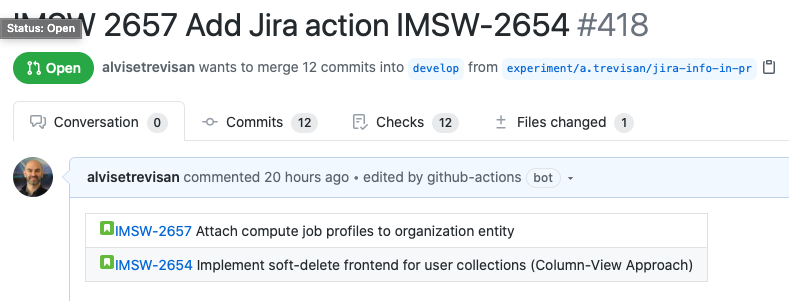

# jira-details-action

> A lightweight solution to integrate GitHub with Jira for project management. 🔎

This action is originally forked from https://github.com/cakeinpanic/jira-description-action, but adds some functionality and removes some. It is by no means a judgment on the nice work of [cakeinpanic](https://github.com/cakeinpanic) - just something that better fits our use cases at [ENPICOM](https://www.enpicom.com).


## Installation

To make `jira-details-action` a part of your workflow, just add a `jira-details-action.yml` file in your `.github/workflows/` directory in your GitHub repository.

```yml
name: Add Jira details to PR
on:
  pull_request:
    types: [opened, edited]
jobs:
  add-jira-description:
    runs-on: ubuntu-latest
    steps:
      - uses: alvisetrevisan/jira-details-action@master
        with:
          github-token: ${{ secrets.GITHUB_TOKEN }}
          jira-token: ${{ secrets.JIRA_TOKEN }}
          jira-base-url: https://your-domain.atlassian.net
          skip-branches: '^(production-release|master|release\/v\d+)$' # optional
          use-branch-name: false # optional
          encode-jira-token: false # optional
```

## Features
When a PR passes the above check, `jira-details-action` will also add details of all discovered Jira issues to the top of the PR description. 

### Options

| key                    | description                                                                                                                                                                                                                                                                                                        | required | default |
| ---------------------- | ------------------------------------------------------------------------------------------------------------------------------------------------------------------------------------------------------------------------------------------------------------------------------------------------------------------ | -------- | ------- |
| `github-token`         | Token used to update PR description. `GITHUB_TOKEN` is already available [when you use GitHub actions](https://help.github.com/en/actions/automating-your-workflow-with-github-actions/authenticating-with-the-github_token#about-the-github_token-secret), so all that is required is to pass it as a param here. | true     | null    |
| `jira-token`           | Token used to fetch Jira Issue information.  Check [below](#jira-token) for more details on how to generate the token.                                                                                                          | true     | null    |
| `jira-base-url`        | The subdomain of JIRA cloud that you use to access it. Ex: "https://your-domain.atlassian.net".                                                                                                                                                                                                                    | true     | null    |
| `skip-branches`        | A regex to ignore running `jira-details-action` on certain branches, like production etc.                                                                                                                                                                                                                                    | false    | ' '     |
| `use-branch-name`      | Search for issue number in branch name (boolean) title                                                                                                                                                                                                                                  | false    | false     |
| `encode-jira-token`      | Base64-encode the Jira token (boolean)                                                                                                                                                                                                                                   | false    | false     |

Tokens are private, so you should add them as [GitHub secrets](https://help.github.com/en/actions/automating-your-workflow-with-github-actions/creating-and-using-encrypted-secrets).

### `jira-token`

The Jira token is used to fetch issue information via the Jira REST API. To get the token:-
1. Generate an [API token via JIRA](https://confluence.atlassian.com/cloud/api-tokens-938839638.html)
2. Add value `<jira username>:<jira api token>` to the `JIRA_TOKEN` secret in your GitHub project.
   For example, if the username is `ci@example.com` and the token is `954c38744be9407ab6fb`, then `ci@example.com:954c38744be9407ab6fb` needs to be added as a secret. You might also decide to encode it as a base64 string yourself: in that case set the `encode-jira-token` input to `true`.

Note: The user should have the [required permissions (mentioned under GET Issue)](https://developer.atlassian.com/cloud/jira/platform/rest/v3/?utm_source=%2Fcloud%2Fjira%2Fplatform%2Frest%2F&utm_medium=302#api-rest-api-3-issue-issueIdOrKey-get).

### Skipping branches

`skip-branches` must be a regex which will work for all sets of branches you want to ignore. This is useful for merging protected/default branches into other branches. Check out some examples in the tests in the repo.

`jira-details-action` already skips PRs which are filed by [dependabot](https://github.com/marketplace/dependabot-preview)

### Searching in branch name/PR title

By default issue key is searched in the PR title (which can easily be changed). `use-branch-name` option can be set to true if you want to get issue key from the branch name .

### Jira issue discovery
The action will discover Jira issues using the following pattern: 
```/([A-Z0-9]{1,10})[ -](\d+)/g```

For example, a PR with title `PROJ 23 Add i18n support. Also fix PROJ-31 and CUST-42` will yield these three JIRA issues: `PROJ-23`, `PROJ-31` and `CUST-42`.